ahora Acceder a tu navegador

   escribe esta dirección http://localhost en la barra de direcciones.
   Si todo ha ido bien y has seguido los pasos anteriores, deberías ver el instalador de la aplicación web que descargaste.

Configurar la aplicación web
    ahora tienes que registrarte
    poniendo un usuario y una contraseña

   El instalador te pedirá que crees un usuario administrador (admin) y que proporciones información sobre la base de datos.
   Debes ingresar la siguiente información:

   que son estos

   Usuario de la base de datos: usuario
   Contraseña de la base de datos: password
   Nombre de la base de datos: bbdd
  Dominio: localhost

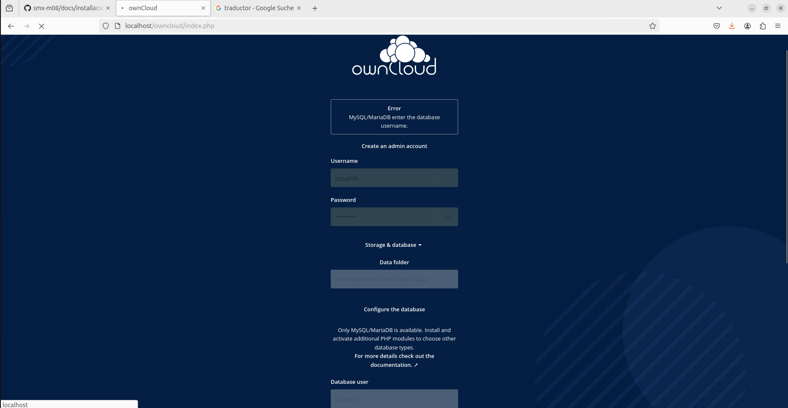

una vez echo ya podras entrar a owncloud pero pedida que inicies sesion

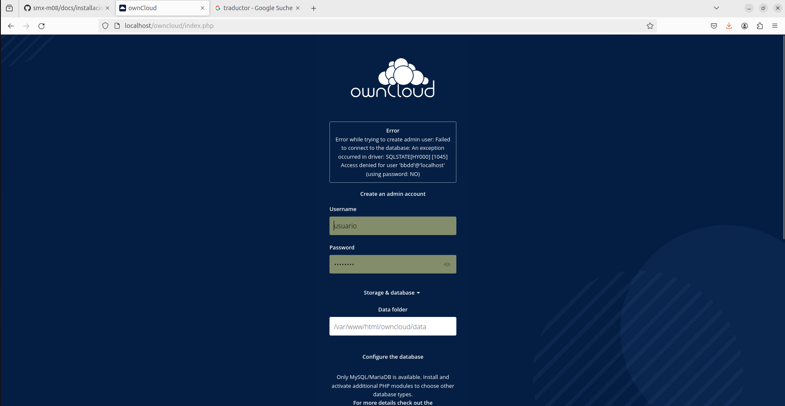

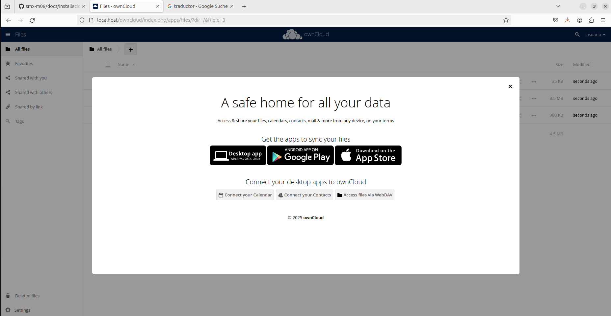

# parte 3 configuracion

28. Demostración del funcionamiento
La demostración del funcionamiento de ownCloud consiste en realizar pruebas básicas para verificar que la plataforma esté funcionando correctamente. Esto incluye:

    Subir archivos: Subir archivos a ownCloud para comprobar que se pueden almacenar y acceder a ellos correctamente.
    
    Crear carpetas: Crear carpetas para organizar los archivos y comprobar que se pueden crear y acceder a ellas correctamente.
    
    Compartir contenidos: Compartir archivos o carpetas con otros usuarios para comprobar que se pueden compartir y acceder a ellos correctamente.

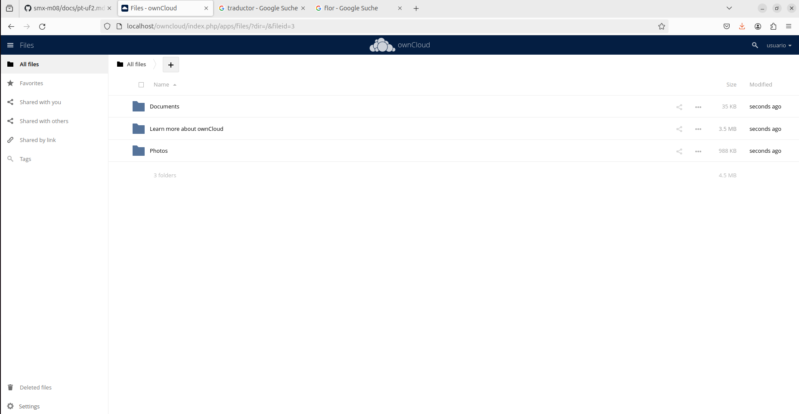

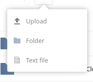

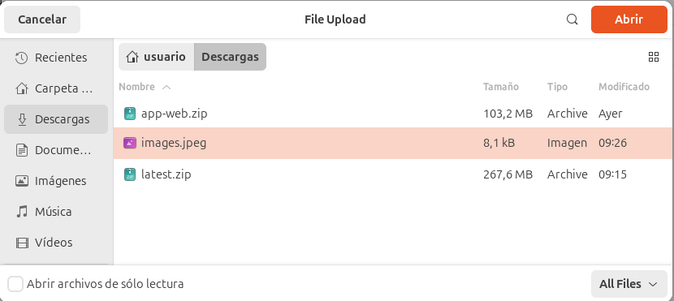

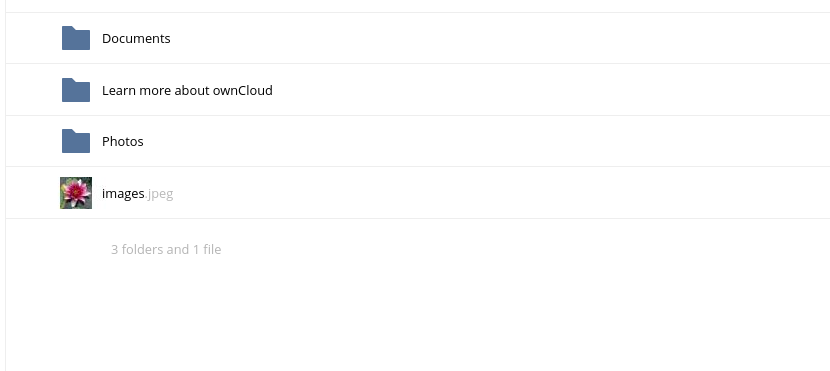

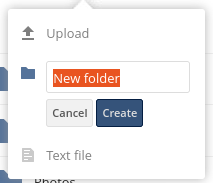

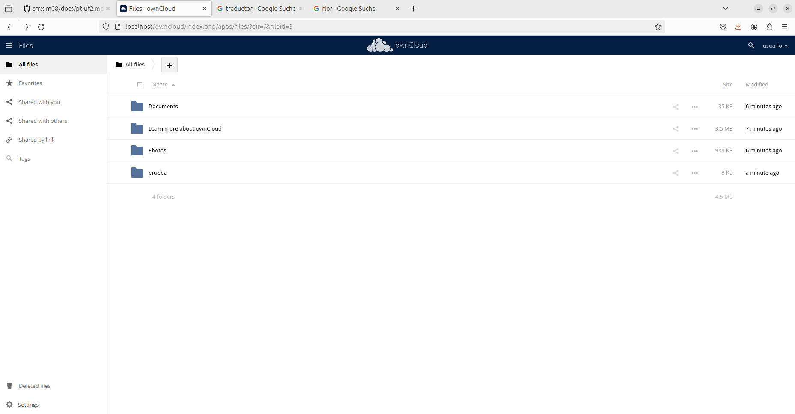

Creación de usuarios
La creación de usuarios consiste en crear varios usuarios con diferentes roles y permisos. En este caso, se deben crear al menos 3 usuarios con los siguientes roles:

   Administrador: Un usuario con permisos totales para gestionar la plataforma y todos los usuarios.

   Editor: Un usuario con permisos para editar y gestionar contenidos, pero no para gestionar la plataforma.

   Visualizador: Un usuario con permisos solo para visualizar contenidos, pero no para editar o gestionar.

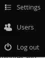

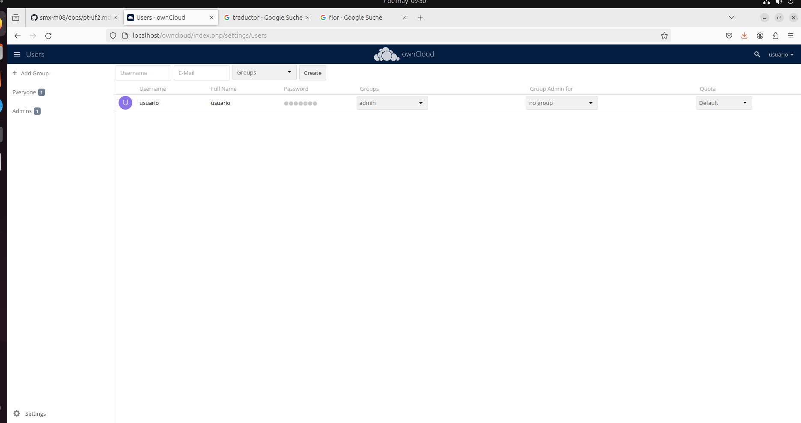

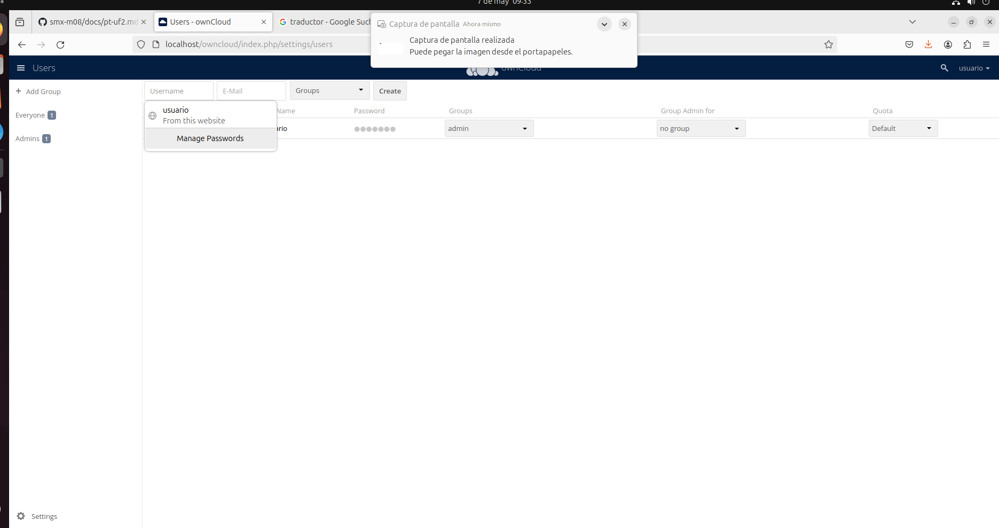

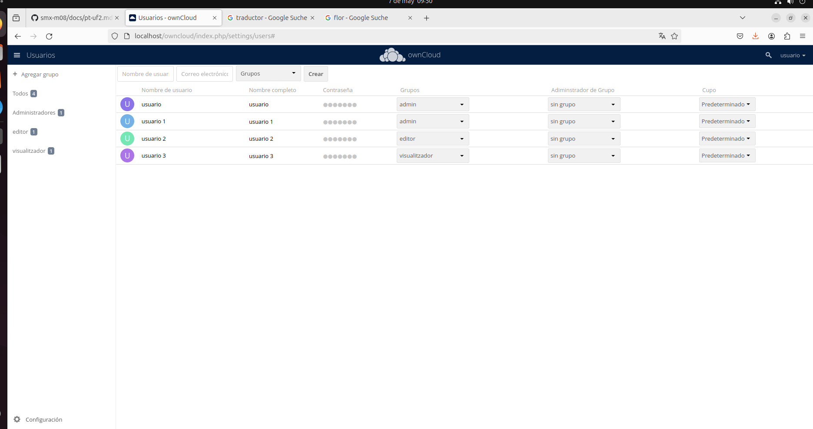

Asignación de roles y permisos
La asignación de roles y permisos consiste en configurar permisos específicos para cada rol. Esto significa que cada rol tendrá permisos diferentes para acceder a los archivos y carpetas de ownCloud. Por ejemplo:

   El administrador tendrá permisos para gestionar todos los archivos y carpetas.

  El editor tendrá permisos para editar y gestionar archivos y carpetas específicas.

   El visualizador tendrá permisos solo para visualizar archivos y carpetas específicas.

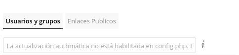

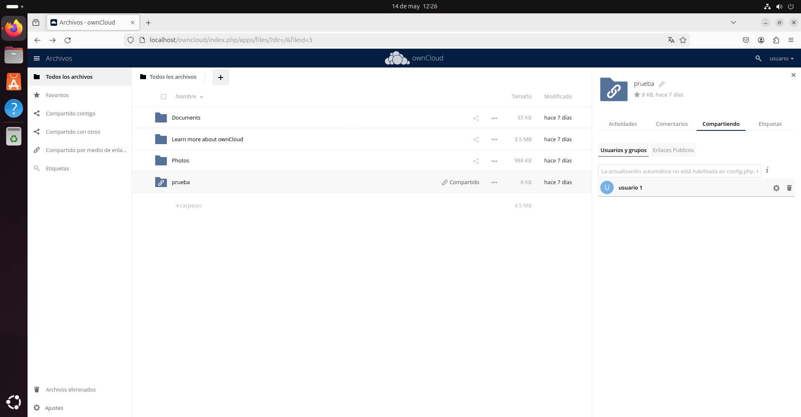

Esperamos que este manual te haya sido de ayuda para configurar y utilizar ownCloud de manera efectiva. ¡Buena suerte en tu proyecto!
