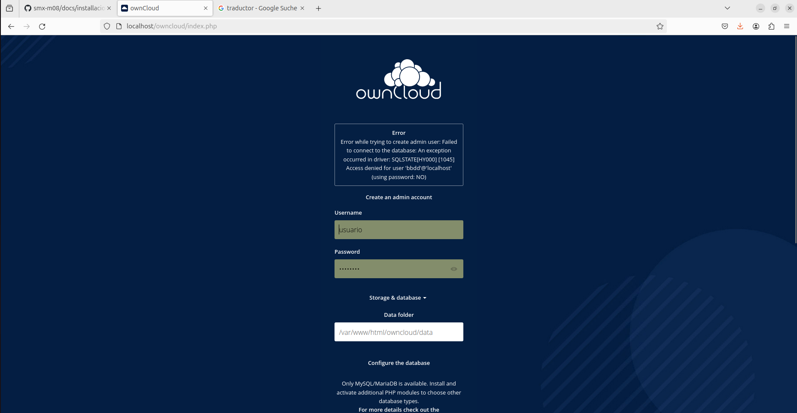
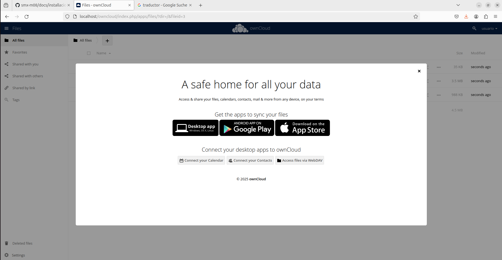
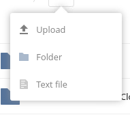
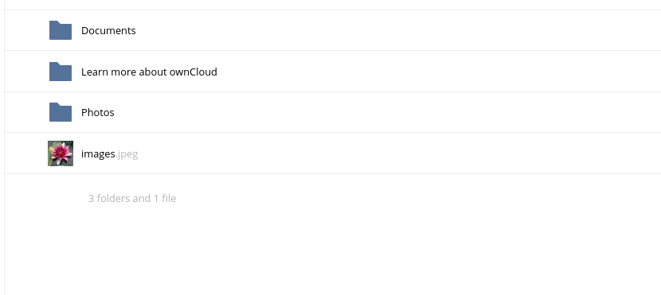
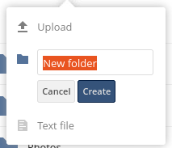
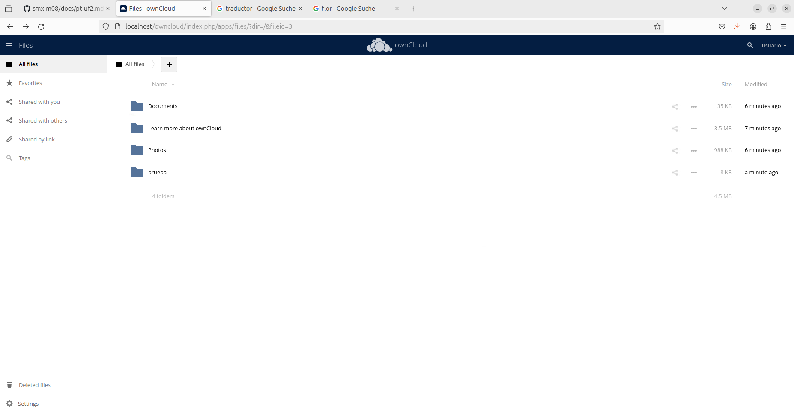
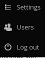
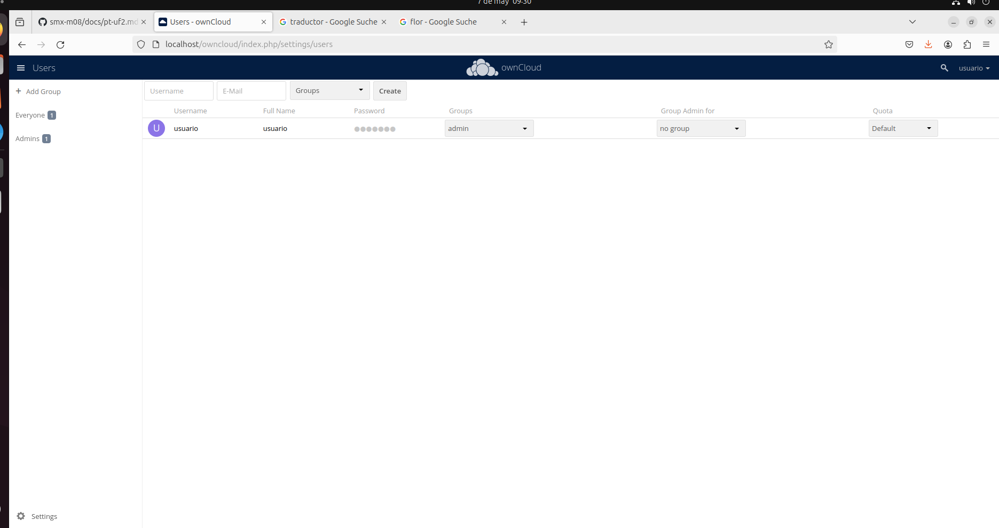
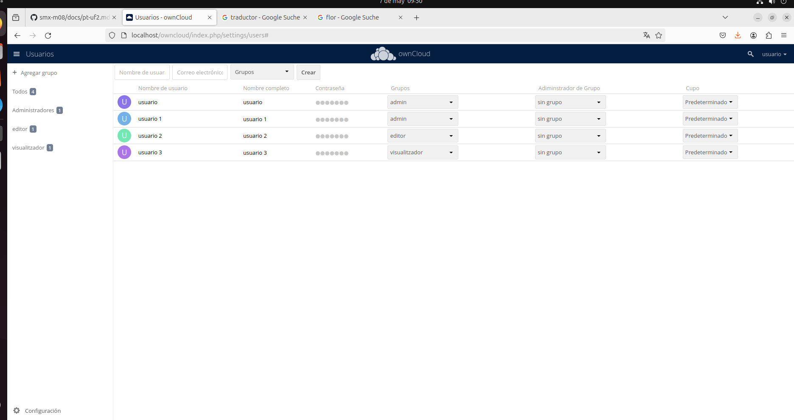
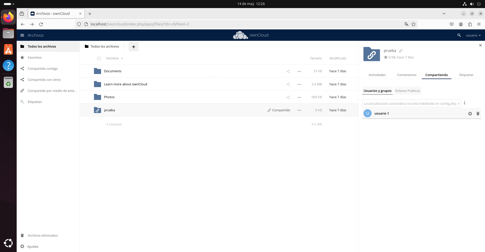

# parte 1: instalacion

1. creamos la maquina virtual para pone el owncloud

2. Actualizar el sistema: Se actualizan las listas de paquetes disponibles y se actualizan todos los paquetes del sistema a las versiones más recientes.

3. Instalar requisitos previos de PPA: Se instalan las herramientas necesarias para trabajar con repositorios PPA (Personal Package Archives).

 

4. Agregar repositorio PPA de PHP: Se agrega un repositorio que contiene las versiones más recientes de PHP, incluida la versión 7.4.

 

5. Instalar PHP 7.4: Se instala el paquete básico de PHP 7.4

 

6. Instalar librerías adicionales de PHP:Se instalan varias librerías adicionales de PHP 7.4 que pueden ser necesarias para diferentes aplicaciones, como:

    Módulo de Apache2 para PHP 7.4
    Servidor de FastCGI de PHP 7.4
    Librerías comunes de PHP 7.4

 

7. Seleccionar versión de PHP: Se selecciona la versión de PHP que se quiere utilizar como predeterminada.

 

8. Activar módulos de Apache2: Se activan los módulos de Apache2 necesarios para PHP 7.4, como el módulo de FastCGI y la configuración de PHP-FPM.

9. Reiniciar Apache2: Se reinicia el servidor Apache2 para aplicar los cambios y asegurarse de que todo esté funcionando correctamente.

# parte 2: instalacion de apache 2.0

11. Actualizar lista de paquetes: Se actualiza la lista de paquetes disponibles en el sistema para asegurarse de que se tienen las versiones más recientes.

12. Actualizar paquetes: Se actualizan todos los paquetes del sistema a las versiones más recientes para asegurarse de que se tienen las últimas mejoras y correcciones de seguridad.

13. Instalar servidor web Apache2: Se instala un servidor web que permite servir contenido web a los usuarios.

14. Instalar servidor de bases de datos MySQL: Se instala un servidor de bases de datos que permite almacenar y gestionar datos de manera eficiente.

15. Instalar PHP y módulo Apache2: Se instala el lenguaje de programación PHP y se configura para trabajar con el servidor web Apache2.

16. Instalar librerías adicionales de PHP: Se instalan varias librerías adicionales de PHP que pueden ser necesarias para diferentes aplicaciones, como procesamiento de imágenes, conexiones a bases de datos, etc.

17. Reiniciar servidor Apache2: Se reinicia el servidor web para aplicar los cambios y asegurarse de que todo esté funcionando correctamente.

18. Acceder a la consola de MySQL: Se accede a la consola de MySQL para gestionar la base de datos.

19. Crear base de datos: Se crea una nueva base de datos para almacenar datos.

20. Crear usuario: Se crea un nuevo usuario de MySQL con acceso a la base de datos.

21. Dar privilegios al usuario: Se da al usuario acceso total a la base de datos para que pueda realizar operaciones de lectura y escritura.

22. Salir de la base de datos: Se sale de la consola de MySQL después de configurar la base de datos y el usuario.

23. Se copia un archivo comprimido (app-web.zip) al directorio raíz del servidor web.

24. Se cambia el directorio actual al directorio raíz del servidor web.

25. Se descomprime el archivo comprimido en el directorio actual, extrayendo los archivos y directorios contenidos en él.

26. Se elimina un directorio específico (app-web/) y todo su contenido. Se elimina el archivo index.html predeterminado del directorio raíz del servidor web.

27. Se cambian los permisos del directorio y sus contenidos para permitir que el propietario tenga control total y otros usuarios puedan leer y ejecutar archivos. Se cambia el propietario del directorio y sus contenidos a un usuario específico y al grupo del servidor web, para que el servidor pueda acceder a los archivos y directorios.

ahora Acceder a tu navegador

    escribe esta dirección http://localhost en la barra de direcciones.
    Si todo ha ido bien y has seguido los pasos anteriores, deberías ver el instalador de la aplicación web que descargaste.

Configurar la aplicación web
    ahora tienes que registrarte
    poniendo un usuario y una contraseña

    El instalador te pedirá que crees un usuario administrador (admin) y que proporciones información sobre la base de datos.
    Debes ingresar la siguiente información:

    que son estos

    Usuario de la base de datos: usuario
    Contraseña de la base de datos: password
    Nombre de la base de datos: bbdd
    Dominio: localhost

una vez echo ya podras entrar a owncloud pero pedida que inicies sesion

# parte 3 configuracion

28. Demostración del funcionamiento
La demostración del funcionamiento de ownCloud consiste en realizar pruebas básicas para verificar que la plataforma esté funcionando correctamente. Esto incluye:

    Subir archivos: Subir archivos a ownCloud para comprobar que se pueden almacenar y acceder a ellos correctamente.
    
    Crear carpetas: Crear carpetas para organizar los archivos y comprobar que se pueden crear y acceder a ellas correctamente.
    
    Compartir contenidos: Compartir archivos o carpetas con otros usuarios para comprobar que se pueden compartir y acceder a ellos correctamente.

Creación de usuarios
La creación de usuarios consiste en crear varios usuarios con diferentes roles y permisos. En este caso, se deben crear al menos 3 usuarios con los siguientes roles:

    Administrador: Un usuario con permisos totales para gestionar la plataforma y todos los usuarios.

    Editor: Un usuario con permisos para editar y gestionar contenidos, pero no para gestionar la plataforma.

    Visualizador: Un usuario con permisos solo para visualizar contenidos, pero no para editar o gestionar.

Asignación de roles y permisos
La asignación de roles y permisos consiste en configurar permisos específicos para cada rol. Esto significa que cada rol tendrá permisos diferentes para acceder a los archivos y carpetas de ownCloud. Por ejemplo:

    El administrador tendrá permisos para gestionar todos los archivos y carpetas.

    El editor tendrá permisos para editar y gestionar archivos y carpetas específicas.

    El visualizador tendrá permisos solo para visualizar archivos y carpetas específicas.

Esperamos que este manual te haya sido de ayuda para configurar y utilizar ownCloud de manera efectiva. ¡Buena suerte en tu proyecto!
