# parte 1: instalacion

1. creamos la maquina virtual para pone el owncloud

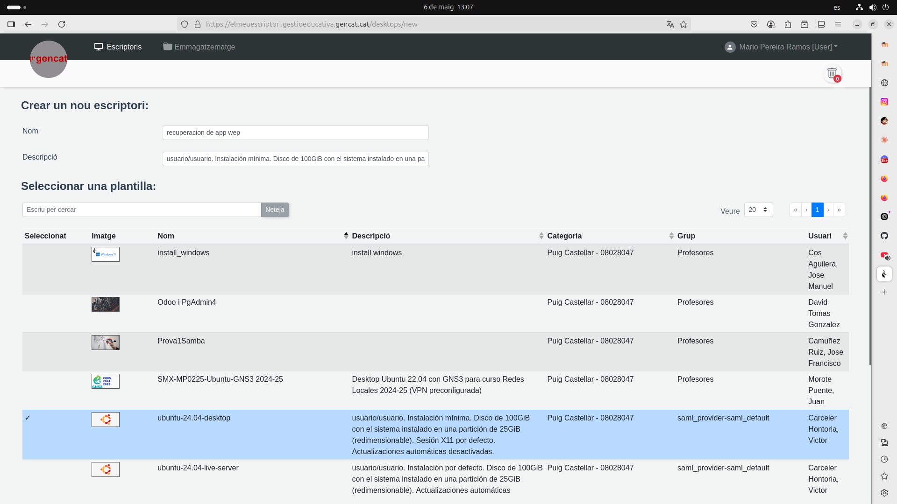

2. Actualizar el sistema: Se actualizan las listas de paquetes disponibles y se actualizan todos los paquetes del sistema a las versiones más recientes.

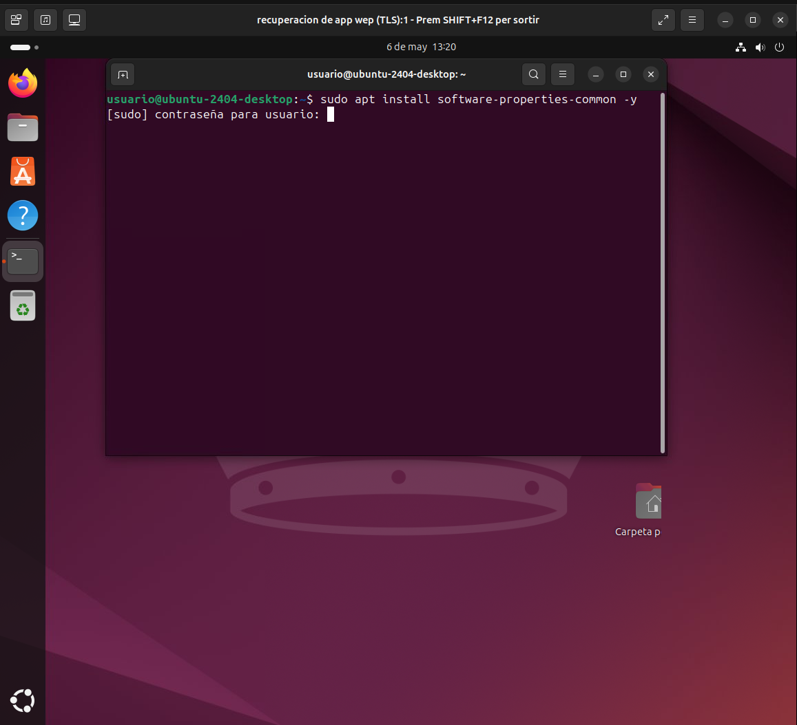

3. Instalar requisitos previos de PPA: Se instalan las herramientas necesarias para trabajar con repositorios PPA (Personal Package Archives).

 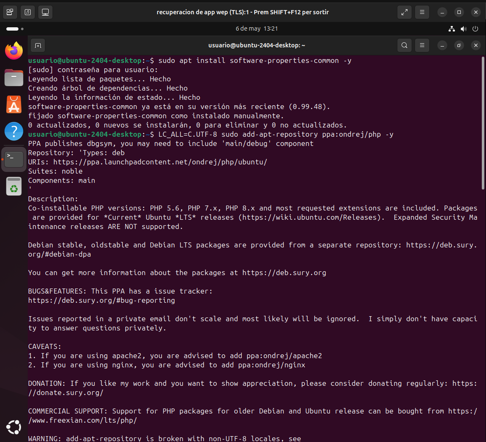

4. Agregar repositorio PPA de PHP: Se agrega un repositorio que contiene las versiones más recientes de PHP, incluida la versión 7.4.

 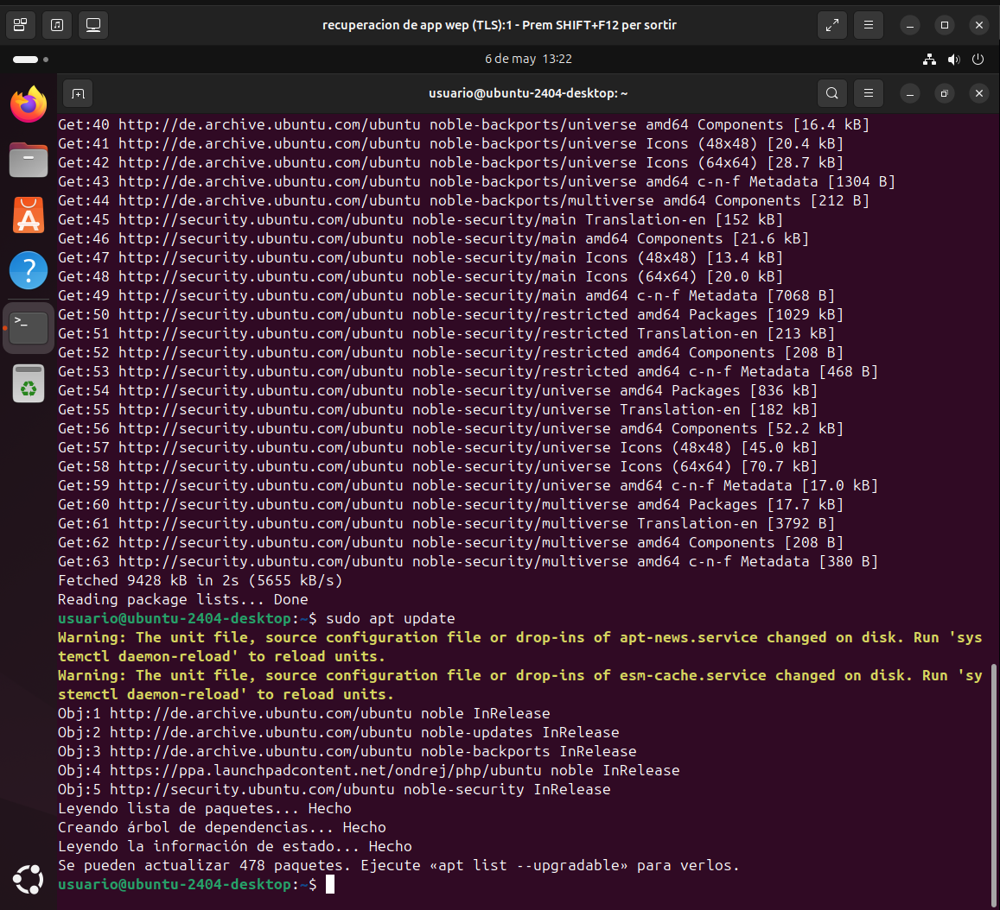

5. Instalar PHP 7.4: Se instala el paquete básico de PHP 7.4

 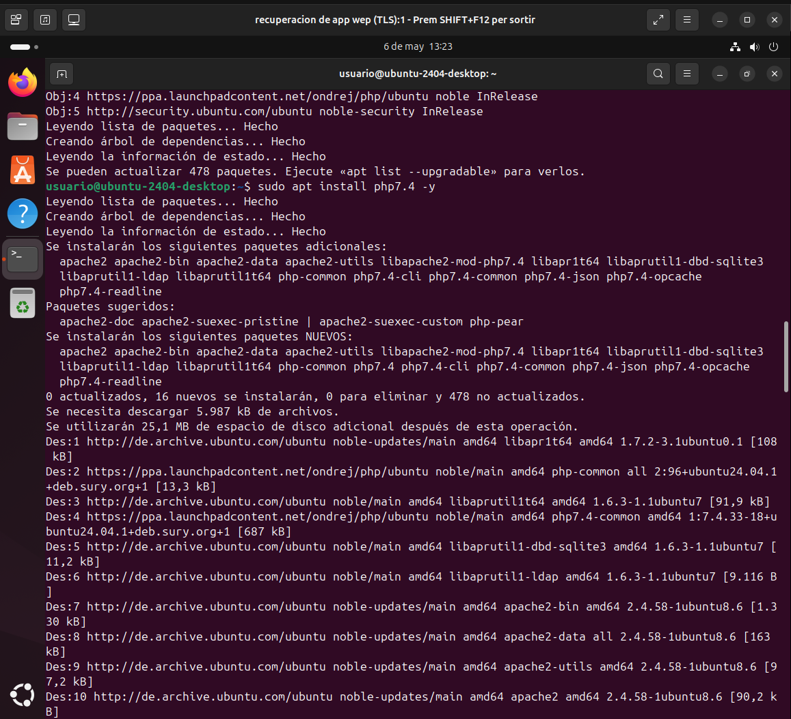

6. Instalar librerías adicionales de PHP:Se instalan varias librerías adicionales de PHP 7.4 que pueden ser necesarias para diferentes aplicaciones, como:

    Módulo de Apache2 para PHP 7.4
    Servidor de FastCGI de PHP 7.4
    Librerías comunes de PHP 7.4

 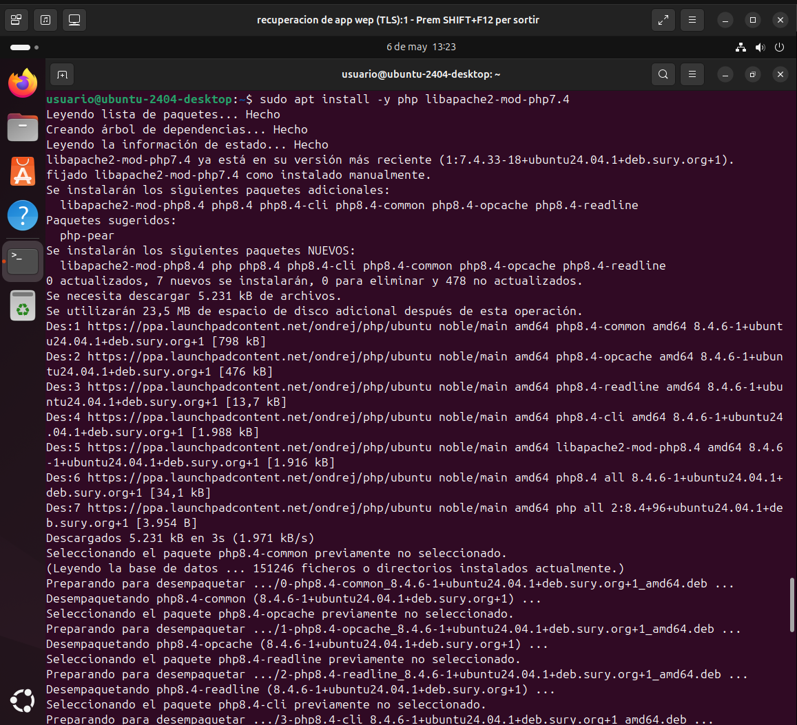

7. Seleccionar versión de PHP: Se selecciona la versión de PHP que se quiere utilizar como predeterminada.

 

8. Activar módulos de Apache2: Se activan los módulos de Apache2 necesarios para PHP 7.4, como el módulo de FastCGI y la configuración de PHP-FPM.

9. Reiniciar Apache2: Se reinicia el servidor Apache2 para aplicar los cambios y asegurarse de que todo esté funcionando correctamente.

# parte 2: instalacion de apache 2.0

11. Actualizar lista de paquetes: Se actualiza la lista de paquetes disponibles en el sistema para asegurarse de que se tienen las versiones más recientes.

12. Actualizar paquetes: Se actualizan todos los paquetes del sistema a las versiones más recientes para asegurarse de que se tienen las últimas mejoras y correcciones de seguridad.

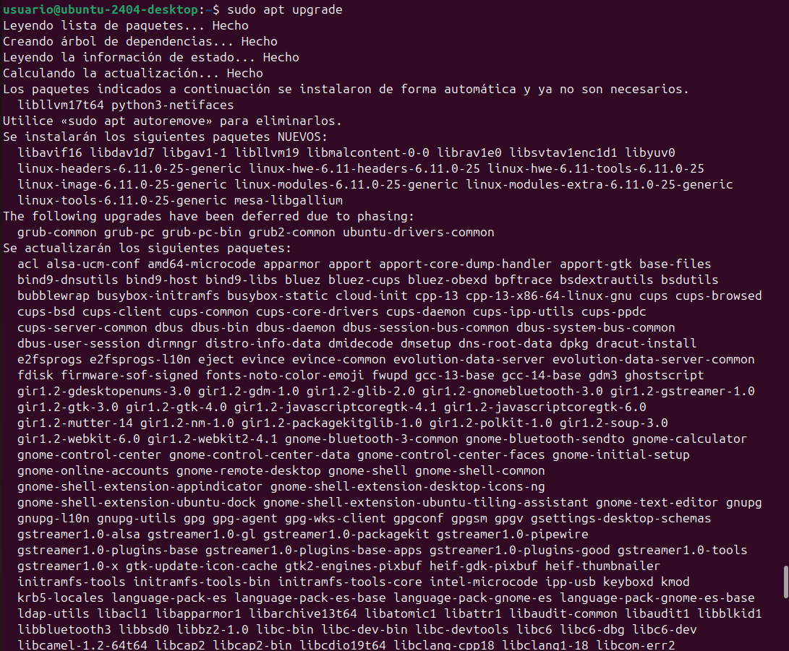

13. Instalar servidor web Apache2: Se instala un servidor web que permite servir contenido web a los usuarios.

14. Instalar servidor de bases de datos MySQL: Se instala un servidor de bases de datos que permite almacenar y gestionar datos de manera eficiente.

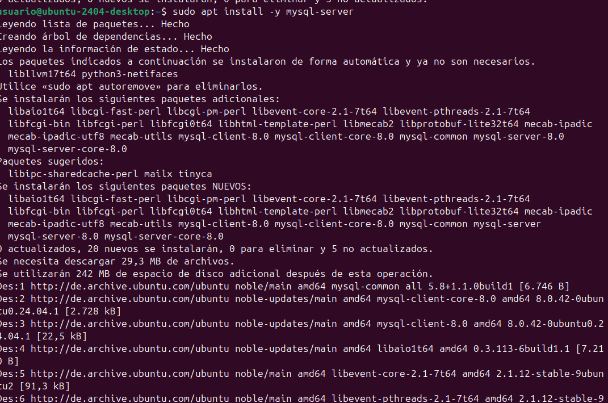

15. Instalar PHP y módulo Apache2: Se instala el lenguaje de programación PHP y se configura para trabajar con el servidor web Apache2.

16. Instalar librerías adicionales de PHP: Se instalan varias librerías adicionales de PHP que pueden ser necesarias para diferentes aplicaciones, como procesamiento de imágenes, conexiones a bases de datos, etc.

17. Reiniciar servidor Apache2: Se reinicia el servidor web para aplicar los cambios y asegurarse de que todo esté funcionando correctamente.

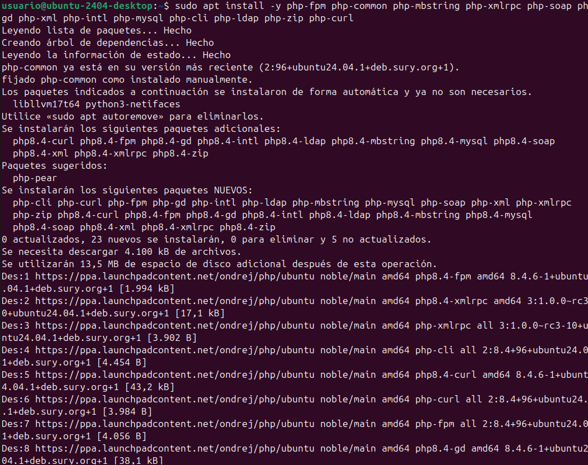

18. Acceder a la consola de MySQL: Se accede a la consola de MySQL para gestionar la base de datos.

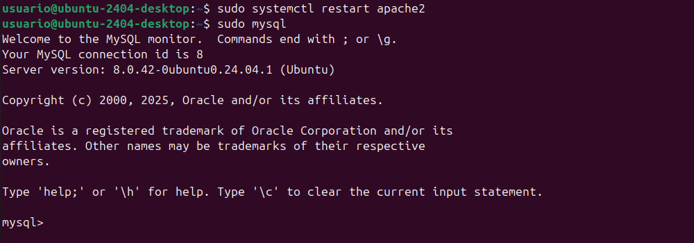

19. Crear base de datos: Se crea una nueva base de datos para almacenar datos.

20. Crear usuario: Se crea un nuevo usuario de MySQL con acceso a la base de datos.

21. Dar privilegios al usuario: Se da al usuario acceso total a la base de datos para que pueda realizar operaciones de lectura y escritura.

22. Salir de la base de datos: Se sale de la consola de MySQL después de configurar la base de datos y el usuario.

23. Se copia un archivo comprimido (app-web.zip) al directorio raíz del servidor web.

24. Se cambia el directorio actual al directorio raíz del servidor web.

25. Se descomprime el archivo comprimido en el directorio actual, extrayendo los archivos y directorios contenidos en él.

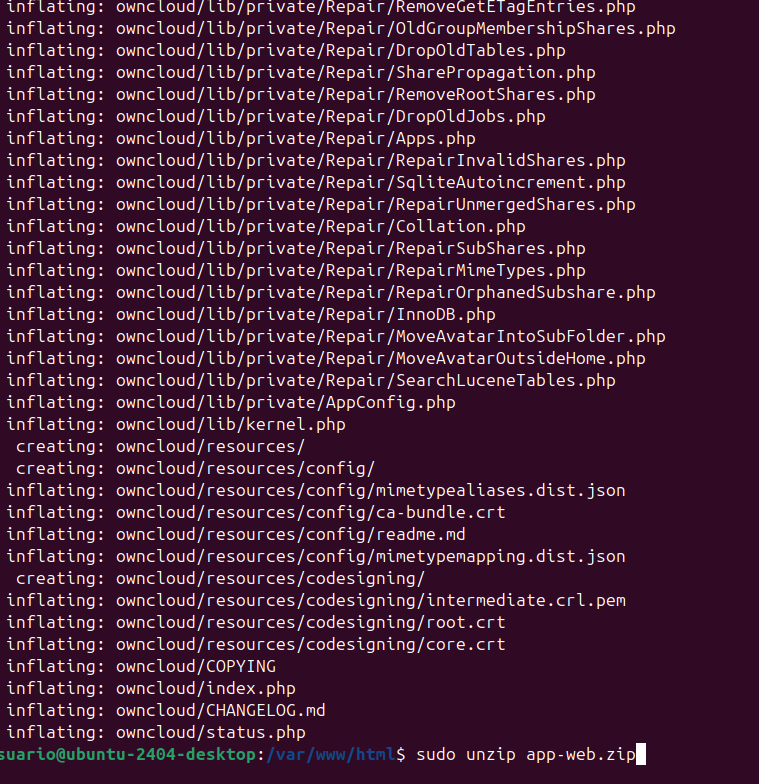

26. Se elimina un directorio específico (app-web/) y todo su contenido. Se elimina el archivo index.html predeterminado del directorio raíz del servidor web.

27. Se cambian los permisos del directorio y sus contenidos para permitir que el propietario tenga control total y otros usuarios puedan leer y ejecutar archivos. Se cambia el propietario del directorio y sus contenidos a un usuario específico y al grupo del servidor web, para que el servidor pueda acceder a los archivos y directorios.

ahora Acceder a tu navegador

escribe esta dirección http://localhost en la barra de direcciones.
Si todo ha ido bien y has seguido los pasos anteriores, deberías ver el instalador de la aplicación web que descargaste.

Configurar la aplicación web
    ahora tienes que registrarte
    poniendo un usuario y una contraseña

El instalador te pedirá que crees un usuario administrador (admin) y que proporciones información sobre la base de datos.
Debes ingresar la siguiente información:

que son estos

Usuario de la base de datos: usuario
Contraseña de la base de datos: password
Nombre de la base de datos: bbdd
Dominio: localhost

una vez echo ya podras entrar a owncloud pero pedida que inicies sesion

